# MAWAQIT Screen Toggle On/Off Feature - Complete Technical Documentation

## Overview

The Screen Toggle On/Off feature is a sophisticated system that automatically controls TV/display screens in mosques, turning them on before prayer times and off after prayer times. This feature is designed specifically for Android TV boxes and tablets used in mosque environments.

## Architecture Overview

### Core Components

1. **User Interface Layer** (`screen_lock_widget.dart`)
   - Toggle switch for enabling/disabling the feature
   - Time configuration controls (minutes before/after prayer)
   - Mode selection (All Prayers vs Fajr/Isha only)
   - Battery optimization warnings
   - Save functionality

2. **State Management Layer** (`screen_lock_notifier.dart` + `screen_lock_state.dart`)
   - Manages UI state using Riverpod
   - Handles user interactions and validation
   - Coordinates with business logic layer

3. **Business Logic Layer** (`toggle_screen_feature_manager.dart`)
   - Core scheduling engine
   - Multi-day alarm management
   - Battery optimization integration
   - Background health monitoring
   - Auto-rescheduling logic

4. **Work Manager Layer** (`work_manager_services.dart`)
   - Android alarm registration
   - Callback function management
   - Device type detection and routing

5. **Hardware Control Layer** (External `screen_control` package)
   - Direct screen hardware control
   - Separate methods for different device types

6. **Battery Optimization Layer** (`battery_optimization_helper.dart`)
   - Battery optimization status checking
   - User education and guidance
   - Settings navigation

## Detailed Code Structure

### 1. User Interface (`screen_lock_widget.dart`)

```dart
class _TimePicker extends ConsumerStatefulWidget {
  // Main widget containing all UI elements
}

class __TimePickerState extends ConsumerState<_TimePicker> {
  // Key methods:
  - _buildToggleSwitch()          // Enable/disable feature
  - _buildTimeConfiguration()     // Time settings UI
  - _buildBatteryOptimizationWarning() // Battery status warning
  - _buildSaveButton()           // Save and schedule alarms
}
```

**Key UI Components:**
- **Toggle Switch**: Enables/disables the feature immediately
- **Time Selectors**: Minutes before/after prayer (10-59 minutes)
- **Mode Switch**: All prayers vs Fajr/Isha only
- **Battery Warning**: Visual indicator if optimization is enabled
- **Save Button**: Triggers the complete scheduling process

### 2. State Management (`screen_lock_notifier.dart`)

```dart
class ScreenLockNotifier extends AsyncNotifier<ScreenLockState> {
  // Key methods:
  - toggleActive(bool newValue)           // Toggle feature on/off
  - saveSettings(times, isIshaFajrOnly)   // Save and schedule
  - checkBatteryOptimizationStatus()      // Monitor battery status
}

class ScreenLockState extends Equatable {
  final DateTime selectedTime;      // Current time (with timezone shift)
  final bool isActive;             // Feature enabled/disabled
  final int selectedMinuteBefore;  // Minutes before prayer (10-59)
  final int selectedMinuteAfter;   // Minutes after prayer (10-59)
  final bool isfajrIshaonly;       // Mode: all prayers vs Fajr/Isha only
}
```

### 3. Core Business Logic (`toggle_screen_feature_manager.dart`)

```dart
class ToggleScreenFeature {
  // Constants
  static const int DEFAULT_DAYS_TO_SCHEDULE = 2;        // All prayers mode: 3 days
  static const int FAJR_ISHA_DAYS_TO_SCHEDULE = 6;      // Fajr/Isha mode: 7 days
  static const Duration BACKGROUND_CHECK_INTERVAL = Duration(hours: 6);
  
  // Key methods:
  - scheduleToggleScreen()          // Main scheduling entry point
  - _scheduleForDay()              // Schedule alarms for specific day
  - _schedulePrayerAction()        // Schedule individual alarm
  - cancelAllScheduledTimers()     // Clean up existing alarms
  - backgroundCheckCallback()      // Health monitoring
  - shouldReschedule()            // Auto-rescheduling logic
}
```

**Scheduling Logic:**
- **All Prayers Mode**: Schedules screen ON/OFF for all 5 prayers × 3 days = 30 alarms
- **Fajr/Isha Mode**: Schedules screen ON (Fajr) + OFF (Isha) × 7 days = 14 alarms
- **Time Calculation**: 
  - Screen ON: Prayer Time - beforeMinutes
  - Screen OFF: Prayer Time + afterMinutes

### 4. Work Manager (`work_manager_services.dart`)

```dart
class WorkManagerService {
  // Key methods:
  - registerScreenTask()           // Register alarm with Android
  - cancelTask()                  // Cancel specific alarm
  - _generateUniqueAlarmId()      // Create unique alarm IDs
}

// Callback Functions (executed when alarms fire)
@pragma('vm:entry-point')
void screenOnCallback(int id) {
  await ScreenControl.toggleBoxScreenOn();
}

@pragma('vm:entry-point') 
void screenOffCallback(int id) {
  await ScreenControl.toggleBoxScreenOff();
}

// Tablet variants
void screenOnTabletCallback(int id) {
  await ScreenControl.toggleTabletScreenOn();
}

void screenOffTabletCallback(int id) {
  await ScreenControl.toggleTabletScreenOff();
}
```

**Android Alarm Configuration:**
```dart
AndroidAlarmManager.oneShotAt(
  scheduledTime,
  alarmId,
  callback,
  wakeup: true,                 // Wake device from sleep
  alarmClock: true,            // High priority alarm
  rescheduleOnReboot: true,    // Survive device reboots
  allowWhileIdle: true,        // Work in Doze mode
  exact: true,                 // Precise timing
);
```

### 5. Device Detection (`TimeShiftManager.dart`)

```dart
class TimeShiftManager {
  bool _isLauncherInstalled = false;
  String _deviceModel = "";
  
  // Key methods:
  - _isPackageInstalled()         // Check for MAWAQIT launcher
  - initializeTimes()            // Detect device capabilities
  
  // Getters:
  bool get isLauncherInstalled => _isLauncherInstalled;
  String get deviceModel => _deviceModel;
}
```

**Device Type Logic:**
- **MAWABOX with Launcher**: Uses `screenOnCallback` / `screenOffCallback`
- **Tablets/Other Devices**: Uses `screenOnTabletCallback` / `screenOffTabletCallback`

### 6. Battery Optimization (`battery_optimization_helper.dart`)

```dart
class BatteryOptimizationHelper {
  // Key methods:
  - isBatteryOptimizationDisabled()        // Check current status
  - showBatteryOptimizationDialog()        // User education dialog
  - requestDisableBatteryOptimization()    // Open Android settings
  - checkAndHandleBatteryOptimization()    // Complete flow
}
```

## Data Flow & Execution

### 1. Configuration Phase

```
User Input → UI Widget → State Manager → Business Logic → Data Persistence
```

1. User enables toggle switch
2. User configures time settings (before/after minutes)
3. User selects mode (All prayers vs Fajr/Isha only)
4. User clicks Save button
5. System validates settings and triggers scheduling

### 2. Scheduling Phase

```
Battery Check → Timer Cancellation → Multi-day Scheduling → Alarm Registration → Health Monitoring Setup
```

1. **Battery Optimization Check**: Warn user if optimization is enabled
2. **Clean Slate**: Cancel all existing timers
3. **Multi-day Calculation**: Generate schedule for 3-7 days
4. **Time Calculation**: For each prayer, calculate ON/OFF times
5. **Alarm Registration**: Register with AndroidAlarmManager
6. **Data Persistence**: Save schedule info to SharedPreferences
7. **Health Monitoring**: Setup background checks every 6 hours

### 3. Execution Phase

```
Android Alarm Triggers → Device Detection → Callback Routing → Hardware Control → Event Recording
```

1. **Alarm Fires**: Android system triggers scheduled alarm
2. **Device Detection**: Determine if Box or Tablet
3. **Callback Execution**: Route to appropriate callback function
4. **Hardware Control**: Call screen control methods
5. **Event Recording**: Update last execution time

### 4. Health Monitoring

```
Background Check → Status Validation → Auto-rescheduling → System Recovery
```

Every 6 hours, the system runs **4 critical health checks** to detect alarm failures:

#### **The 6-Hour Background Check: Why It's Critical**

The 6-hour background check is the **most important reliability feature** in the entire system. Modern Android systems can silently kill alarms without any notification, which means users think everything is working while screens don't actually toggle at prayer times.

#### **Health Check Details**

**Check 1: Are Events Actually Scheduled?**
```dart
if (isFeatureActive && !isEventsSet) {
  logger.i('Rescheduling needed: Feature active but no events scheduled');
  return true;
}
```
*Detects: Feature is ON but no alarms are actually scheduled in the system.*

**Check 2: Approaching End of Schedule Window?**
```dart
final rescheduleThreshold = isFajrIshaOnly ? (daysToSchedule - 2) : 1;
if (daysSinceLastSchedule >= rescheduleThreshold) {
  return true;
}
```
*Detects: Only 1 day left (All Prayers) or 2 days left (Fajr/Isha) of scheduled alarms.*

**Check 3: Have ANY Alarms Ever Executed Since Scheduling?**
```dart
if (lastExecutedEventDate == null) {
  final hoursSinceLastSchedule = today.difference(lastEventDate).inHours;
  if (hoursSinceLastSchedule > 24) {
    logger.w('Rescheduling needed: No events have ever executed');
    return true;
  }
}
```
*Detects: Alarms were scheduled over 24 hours ago, but Android has blocked ALL of them from the beginning.*

**Check 4: Recent Execution Activity?**
```dart
final hoursSinceLastExecution = today.difference(lastExecutedEvent).inHours;
if (hoursSinceLastExecution > 24) {
  logger.w('Rescheduling needed: No events executed in the last 24 hours');
  return true;
}
```
*Detects: Alarms used to work fine, but Android recently started blocking them (last 24+ hours).*

#### **Check 3 vs Check 4 - Detective Work Explained**

```mermaid
graph TD
    subgraph "Check 3 vs Check 4 - The Key Difference"
        A["📅 User Schedules Alarms<br/>Monday 9:00 AM"] --> B["💾 lastEventDate = Monday 9:00 AM<br/>(When scheduling happened)"]
        
        B --> C["🔔 Alarm Fires Successfully<br/>Monday 5:00 PM - Screen ON"]
        C --> D["📝 recordEventExecution()<br/>lastExecutedEventDate = Monday 5:00 PM"]
        
        D --> E["🕕 6-Hour Check Runs<br/>Tuesday 3:00 AM"]
        
        E --> F["Check 3: Has ANY alarm ever executed?<br/>if (lastExecutedEventDate == null)"]
        E --> G["Check 4: Recent execution activity?<br/>if (hoursSinceLastExecution > 24)"]
        
        F --> H["✅ lastExecutedEventDate = Monday 5:00 PM<br/>NOT null - Check 3 PASSES"]
        G --> I["✅ Last execution: Monday 5:00 PM<br/>Only 10 hours ago - Check 4 PASSES"]
    end
    
    subgraph "Scenario 1: Check 3 Fails - Never Executed"
        J["📅 User Schedules Alarms<br/>Monday 9:00 AM"] --> K["💾 lastEventDate = Monday 9:00 AM"]
        
        K --> L["❌ Android Blocks ALL Alarms<br/>(Battery optimization enabled)"]
        L --> M["📝 recordEventExecution() NEVER called<br/>lastExecutedEventDate = null"]
        
        M --> N["🕕 6-Hour Check - Tuesday 3:00 AM<br/>(30 hours after scheduling)"]
        
        N --> O["Check 3: lastExecutedEventDate == null?<br/>YES - No alarms ever executed"]
        O --> P["Check 3: Hours since scheduling > 24?<br/>30 hours > 24 ✅"]
        P --> Q["🚨 PROBLEM DETECTED<br/>Rescheduling needed: No events have ever executed"]
    end
    
    subgraph "Scenario 2: Check 4 Fails - Stopped Working"
        R["📅 Alarms Working Fine<br/>Monday-Tuesday"] --> S["📝 lastExecutedEventDate = Tuesday 8:00 PM"]
        
        S --> T["❌ Wednesday: Android Enables Doze Mode<br/>Starts blocking alarms"]
        T --> U["🔔 Wednesday-Thursday Alarms Blocked<br/>No recordEventExecution() calls"]
        
        U --> V["🕕 6-Hour Check - Friday 2:00 AM<br/>(30 hours since last execution)"]
        
        V --> W["Check 3: lastExecutedEventDate exists?<br/>YES - Tuesday 8:00 PM"]
        W --> X["Check 4: Hours since last execution > 24?<br/>30 hours > 24 ✅"]
        X --> Y["🚨 PROBLEM DETECTED<br/>Rescheduling needed: No events executed in last 24h"]
    end
    
    style F fill:#4caf50,color:#fff
    style G fill:#4caf50,color:#fff
    style H fill:#4caf50,color:#fff
    style I fill:#4caf50,color:#fff
    style O fill:#f44336,color:#fff
    style P fill:#f44336,color:#fff
    style Q fill:#ff9800,color:#fff
    style W fill:#4caf50,color:#fff
    style X fill:#f44336,color:#fff
    style Y fill:#ff9800,color:#fff
```



#### **The Two Key Timestamps**

The system tracks **two different timestamps** to enable this detective work:

1. **`lastEventDate`** - When the user **scheduled** the alarms
2. **`lastExecutedEventDate`** - When an alarm **actually executed successfully**

Every time an alarm successfully fires, this code runs:
```dart
// In screenOnCallback, screenOffCallback, etc.
await ScreenControl.toggleBoxScreenOn();
ToggleScreenFeature.recordEventExecution(); // ← Records success!
```

#### **Why Both Checks Are Needed**

| Check | Detects | Scenario | Android Behavior |
|-------|---------|----------|------------------|
| **Check 3** | **Never worked** | Battery optimization enabled from start | Blocks alarms immediately after scheduling |
| **Check 4** | **Stopped working** | Doze mode activated later, system updates | Alarms worked initially, then got blocked |

#### **Real-World Examples**

**Example 1: Check 3 Catches New Installation**
```
User installs MAWAQIT → Enables screen toggle → Battery optimization still ON
→ All alarms blocked immediately → Check 3 detects: "24+ hours, no alarms ever executed"
→ System reschedules and shows battery warning
```

**Example 2: Check 4 Catches System Changes**
```
MAWAQIT working for weeks → Android system update → New power management rules
→ Alarms start getting blocked → Check 4 detects: "Used to work, nothing for 24+ hours"
→ System reschedules with fresh alarm registrations
```

#### **Why 6 Hours Specifically?**

The 6-hour interval balances **reliability** vs **battery efficiency**:

- **✅ Frequent Enough**: Problems caught within 6 hours maximum
- **✅ Infrequent Enough**: Only 4 checks per day, minimal battery impact
- **✅ Prayer Coverage**: Catches issues across different prayer times
- **✅ No Interference**: Runs between prayer times, won't conflict

#### **Auto-Recovery Process**

When any check fails, the system automatically:
1. Cancels all existing alarms (clean slate)
2. Reloads saved user configuration
3. Reschedules everything for the next 3-7 days
4. Updates health monitoring timestamps

## Configuration Constants

### SharedPreferences Keys (`constants.dart`)

```dart
class TurnOnOffTvConstant {
  static const String kActivateToggleFeature = 'activate_toggle_feature';
  static const String kisFajrIshaOnly = 'is_fajr_isha_only';
  static const String kMinuteBeforeKey = 'minute_before_key';
  static const String kMinuteAfterKey = 'minute_after_key';
  static const String kIsEventsSet = 'is_events_set';
  static const String kLastEventDate = 'last_event_date';
  static const String kLastExecutedEventDate = 'last_executed_event_date';
}
```

### Scheduling Constants

```dart
static const int DEFAULT_DAYS_TO_SCHEDULE = 2;        // 3 days total
static const int FAJR_ISHA_DAYS_TO_SCHEDULE = 6;      // 7 days total
static const int BACKGROUND_CHECK_ALARM_ID = 999888777;
static const Duration BACKGROUND_CHECK_INTERVAL = Duration(hours: 6);
```

## External Dependencies

### 1. android_alarm_manager_plus
- **Purpose**: Schedule precise alarms that survive app closure and device sleep
- **Key Methods**: `oneShotAt()`, `cancel()`, `periodic()`
- **Configuration**: High-priority alarms with wake capabilities

### 2. screen_control
- **Purpose**: Direct hardware screen control
- **Methods**: 
  - `toggleBoxScreenOn()` / `toggleBoxScreenOff()` - For MAWABOX devices
  - `toggleTabletScreenOn()` / `toggleTabletScreenOff()` - For tablets

### 3. disable_battery_optimization
- **Purpose**: Check and manage Android battery optimization settings
- **Methods**:
  - `isBatteryOptimizationDisabled` - Status check
  - `showDisableBatteryOptimizationSettings()` - Open settings

### 4. shared_preferences
- **Purpose**: Persistent data storage
- **Usage**: Feature state, configuration, schedule tracking, health monitoring

## Error Handling & Reliability

### 1. Battery Optimization Protection
- Proactive checking before scheduling
- User education through warning dialogs
- Graceful degradation if user skips

### 2. Health Monitoring System
- Background checks every 6 hours
- Auto-detection of scheduling failures
- Automatic rescheduling when issues detected

### 3. Robust Alarm Management
- Unique ID generation to prevent conflicts
- Comprehensive cleanup of old alarms
- Device reboot survival through `rescheduleOnReboot`

### 4. Multi-device Support
- Automatic device type detection
- Separate callback routing for different hardware
- Fallback mechanisms for unknown devices

## Usage Scenarios

### 1. All Prayers Mode (Typical Mosque)
- **Schedule**: 5 prayers × 2 ON/OFF cycles × 3 days = 30 alarms
- **Use Case**: Main prayer hall where screen should be active for all prayers
- **Duration**: 3 days of continuous scheduling

### 2. Fajr/Isha Only Mode (Energy Saving)
- **Schedule**: Screen ON (Fajr) + Screen OFF (Isha) × 7 days = 14 alarms
- **Use Case**: Energy-conscious mosques or secondary displays
- **Duration**: 7 days of scheduling (longer due to fewer alarms)

### 3. Battery-Optimized Devices
- **Challenge**: Android may block alarms to save battery
- **Solution**: Proactive user education and settings guidance
- **Fallback**: System continues with warnings if user skips

## Performance Considerations

### 1. Alarm Efficiency
- Minimal number of alarms scheduled
- Efficient cleanup of expired alarms
- Unique ID generation to prevent conflicts

### 2. Background Processing
- Health checks only every 6 hours (not continuous)
- Efficient SharedPreferences usage
- Minimal wake-up impact on device

### 3. Memory Management
- Static methods where possible
- Efficient data structures for schedule tracking
- Proper cleanup of resources

### **Complete flow**


## Troubleshooting Guide

### Common Issues:
1. **Alarms Not Firing**: Usually battery optimization - check settings
2. **Screen Not Responding**: Hardware issue - verify screen_control package
3. **Scheduling Failures**: Permission issues - check alarm permissions
4. **Health Check Failures**: Background processing limited - check app settings
