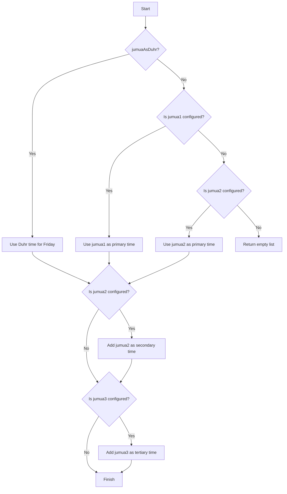
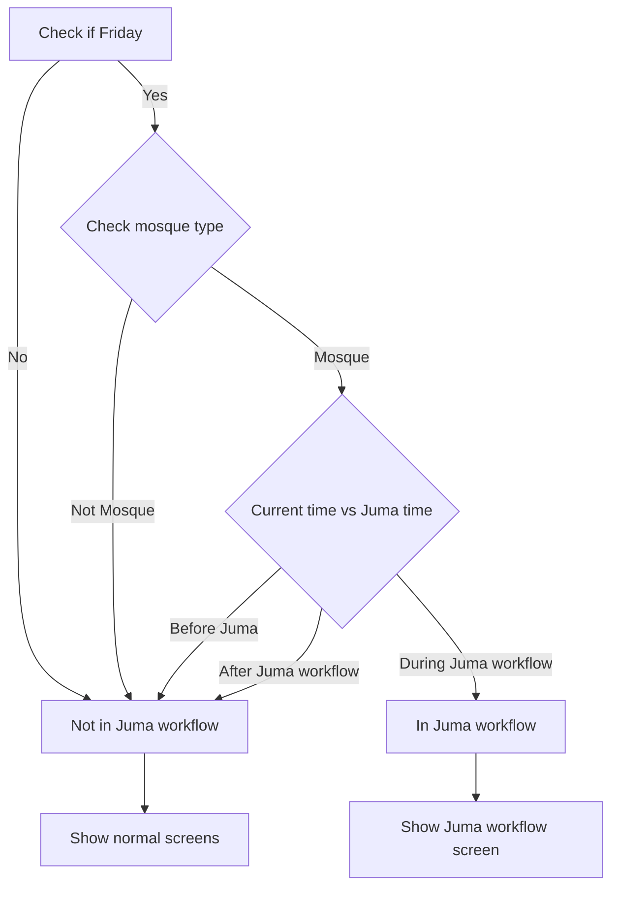

# Juma Prayer Time Handling

This document explains how Juma (Friday prayer) times are handled in the Mawaqit app, including different configuration scenarios and the workflow timing.

## Core Concepts

The Juma prayer time handling is designed to be flexible, allowing for various mosque configurations:

1. **Regular Juma**: Explicitly configured time(s) for Juma prayer
2. **Juma as Duhr**: Using the Duhr prayer time on Friday as the Juma time
3. **Multiple Juma times**: Support for up to three different Juma session times

## Logic Flow

The following diagram shows the decision flow for determining Juma times:



## Workflow Timing

The Juma workflow timing is determined based on the following rules:



The workflow time is defined as the period starting at the Juma time and ending after the Juma timeout (typically 30 minutes) plus Azkar duration.

## Use Cases

### Case 1: Regular Juma

When a mosque explicitly configures one or more Juma times:

```json
{
  "jumua": "13:00",
  "jumua2": "14:30",
  "jumua3": "16:00",
  "jumuaAsDuhr": false
}
```

In this case:
- Primary Juma time: 13:00
- Secondary Juma time: 14:30
- Tertiary Juma time: 16:00
- Workflow follows: 13:00 (primary time only)

### Case 2: Juma as Duhr

When a mosque uses the Duhr prayer time for Juma:

```json
{
  "jumua": null,
  "jumuaAsDuhr": true,
  "duhrTime": "12:30" // From the daily prayer schedule
}
```

In this case:
- Primary Juma time: 12:30 (Duhr time for Friday)
- Workflow follows: 12:30

### Case 3: Mixed Configuration

When a mosque uses Juma as Duhr but also has additional sessions:

```json
{
  "jumuaAsDuhr": true,
  "duhrTime": "12:30", // From the daily prayer schedule
  "jumua2": "14:00",
  "jumua3": "16:00"
}
```

In this case:
- Primary Juma time: 12:30 (Duhr time for Friday)
- Secondary Juma time: 14:00
- Tertiary Juma time: 16:00
- Workflow follows: 12:30 (primary time only)

### Case 4: Jumua2 Without Jumua1

When a mosque only configures jumua2 without jumua1:

```json
{
  "jumua": null,
  "jumua2": "14:00",
  "jumuaAsDuhr": false
}
```

In this case:
- Primary Juma time: 14:00
- Workflow follows: 14:00

### Case 5: No Juma Times Configured

When no Juma times are explicitly configured and jumuaAsDuhr is false:

```json
{
  "jumua": null,
  "jumua2": null,
  "jumua3": null,
  "jumuaAsDuhr": false
}
```

In this case:
- No Juma times are displayed
- Workflow does not activate

## UI Representation

1. **Single Juma Time**: Shows only the primary time
2. **Multiple Juma Times**: Shows primary time prominently, with secondary and tertiary times as additional information
3. **Juma Workflow**: UI elements are activated/highlighted during the Juma workflow time based on the primary time only

## Technical Implementation

The core logic is implemented in three main methods:

1. `getOrderedJumuaTimes()`: Returns ordered list of all available Juma times
2. `activeJumuaaDate()`: Calculates the active Juma date and time for workflow
3. `jumuaaWorkflowTime()`: Determines if current time is during Juma workflow period

These methods ensure consistent handling of Juma times across the application. 