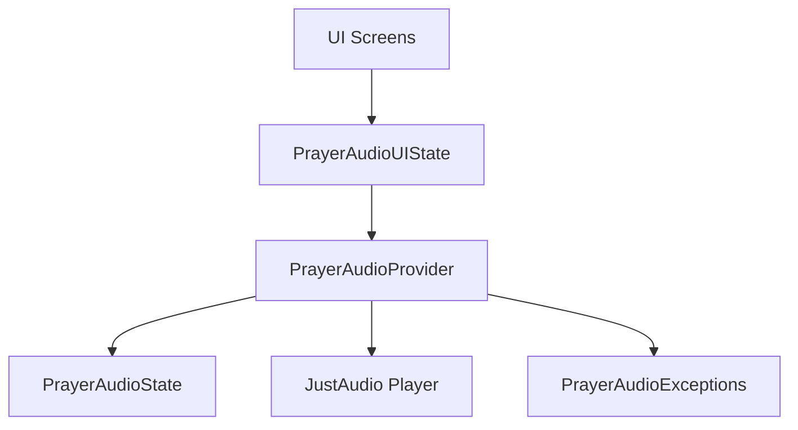
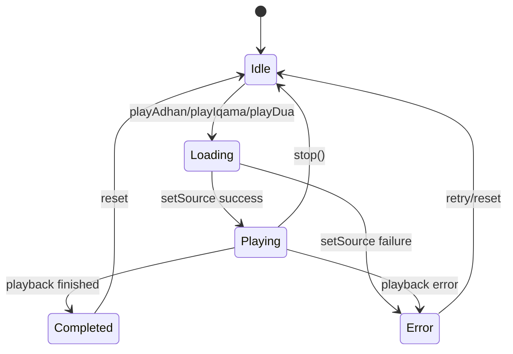
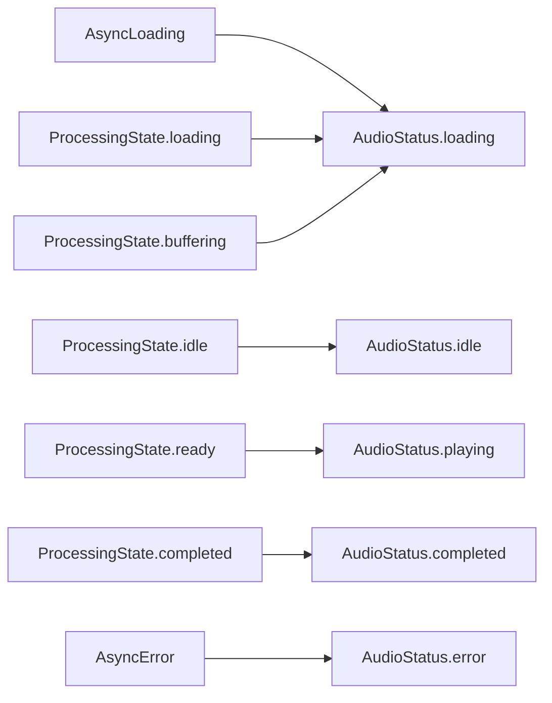
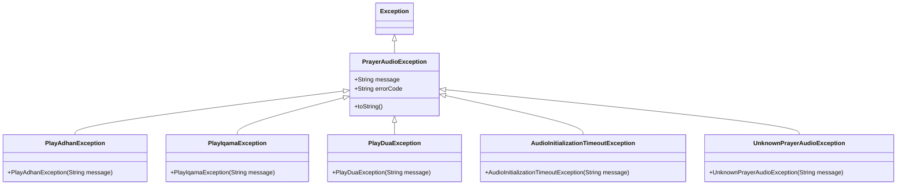
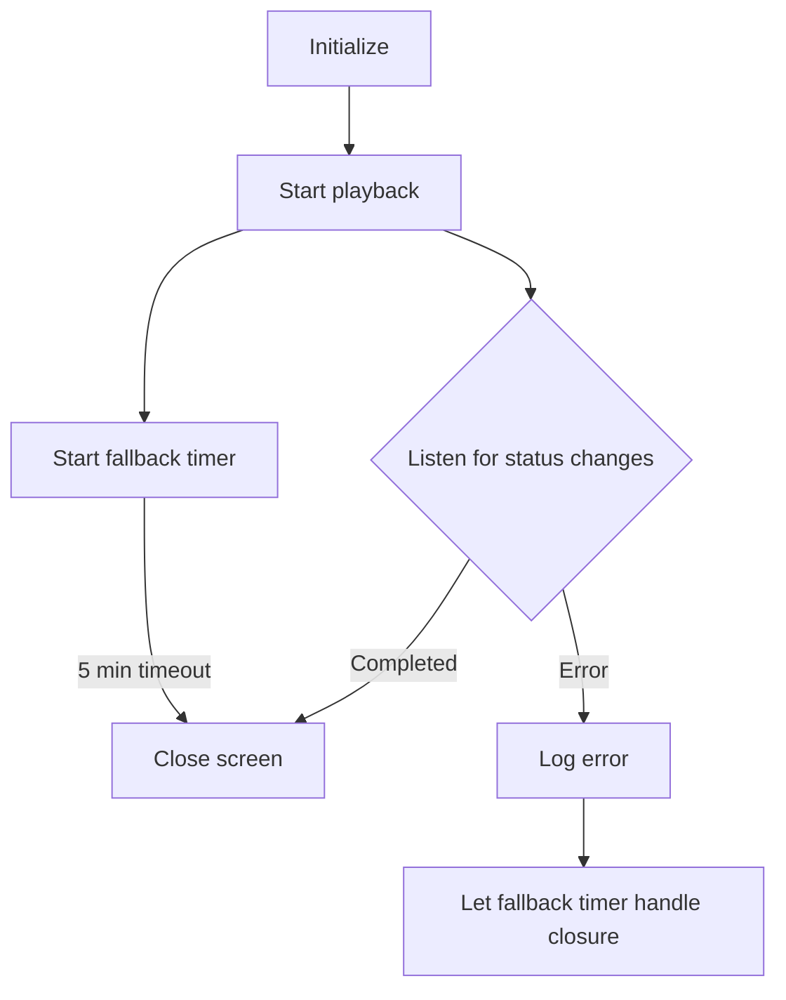
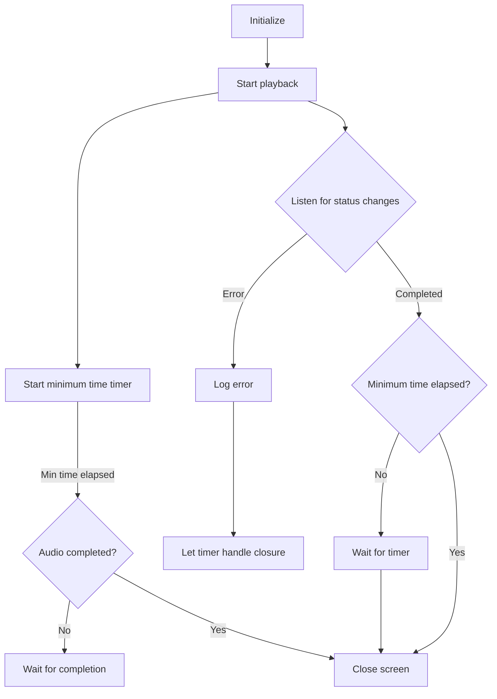
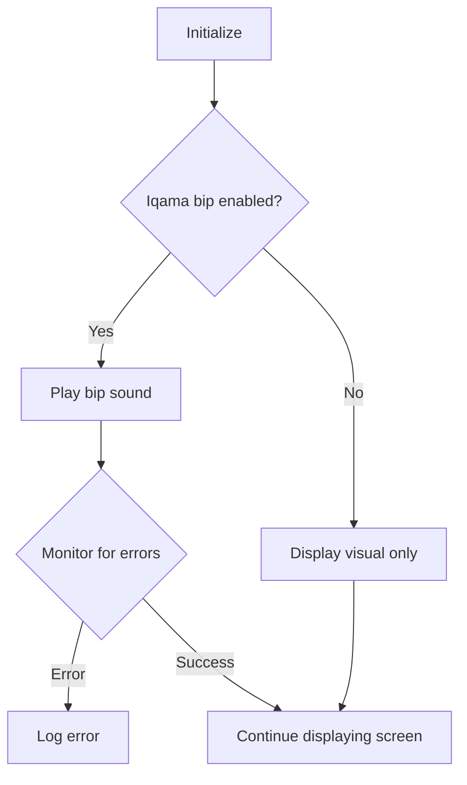

# Prayer Audio Handling

## Table of Contents

- [Core Concepts](#core-concepts)

- [Architecture](#architecture)

- [State Management Flow](#state-management-flow)

- [Error Handling](#error-handling)

- [UI Integration](#ui-integration)

- [Screen Implementation Patterns](#screen-implementation-patterns)

- [Adhan Screen Pattern](#adhan-screen-pattern)

- [After-Adhan Screen Pattern](#after-adhan-screen-pattern)

- [Iqama Screen Pattern](#iqama-screen-pattern)

- [Technical Implementation](#technical-implementation)

  

This document explains how prayer audio (Adhan, Iqama, and post-prayer Dua) is managed in the Mawaqit app using Riverpod's AsyncNotifier pattern for robust state handling.

  

## Core Concepts

  

The Prayer Audio system is built on these key concepts:

  

1. **AsyncValue-based States**: Leveraging Riverpod's AsyncValue to properly track loading, success, and error states

2. **ProcessingState Integration**: Using JustAudio's ProcessingState for detailed audio playback status

3. **Class-based Error Handling**: Structured error classes for consistent error handling

4. **UI State Simplification**: Abstracting complex state into simplified UI models

  

## Architecture

  

The prayer audio system follows a layered architecture:

  

  

The key components are:

  

- **PrayerAudioState**: Core data model with processingState and duration

- **PrayerAudioNotifier**: AsyncNotifier managing audio logic and state transitions

- **PrayerAudioUIState**: Simplified model for UI consumption with AudioStatus enum

- **PrayerAudioExceptions**: Structured error classes for different error scenarios

  

## State Management Flow

  

The audio state flows through these stages:

  

  

### AudioStatus to ProcessingState Mapping

  

  

## Error Handling

  

Error handling uses a class hierarchy for structured error management:

  

  

## UI Integration

  
## Screen Implementation Patterns

  

### Adhan Screen Pattern

  

The key pattern for Adhan playback screens:

  

  

### After-Adhan Screen Pattern

  

The after-Adhan pattern includes a minimum display time:

  

  

### Iqama Screen Pattern

  

The simpler Iqama screen pattern:

  

  

## Technical Implementation

  
