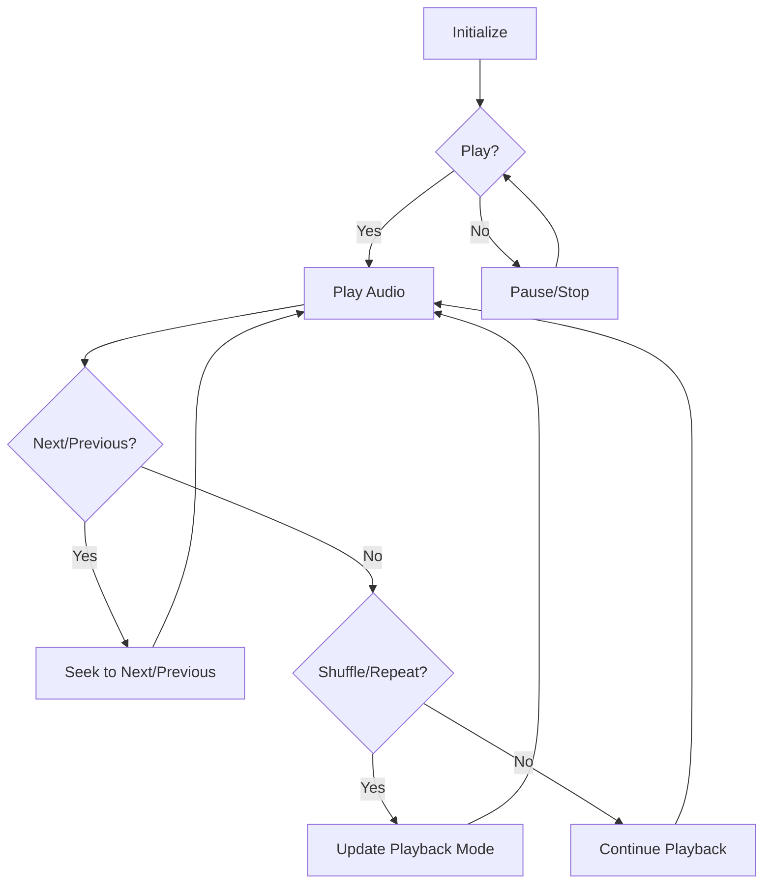

## Overview

The QuranAudioPlayer module is responsible for managing audio playback of single suwar for reciter. It provides functionalities to play, pause, stop, seek, shuffle, and repeat audio tracks, as well as manage a playlist of surahs.

## User Stories

- As a user, I can play, pause, and stop quran audio.
- As a user, I can navigate between different surah in the playlist.
- As a user, I can seek to a specific position within a surah.
- As a user, I can shuffle the playlist.
- As a user, I can repeat a single surah.

## Requirements

### Functional Requirements

- **Audio Playback**: The module should support playing, pausing, and stopping audio.
- **Playlist Management**: The module should manage a playlist of quran surahs.
- **Navigation**: Users should be able to move to the next or previous surah in the playlist.
- **Seeking**: The module should allow seeking to a specific position within a surah.
- **Shuffling**: The playlist should be able to be shuffled.
- **Repeating**: A single surah should be able to be repeated.

### Non-Functional Requirements

- **Performance**: The audio playback should be smooth and responsive.
- **State Management**: The module should efficiently manage and update the player's state.
- **Error Handling**: The module should gracefully handle and report errors.

### Flow Diagram

### Flow of Operations

1. Initialize the audio player with a playlist of surahs
2. Play the selected surah
3. Update the player state (playing, paused, stopped)
4. Handle user interactions:
   a. Pause/Stop playback
   b. Seek to a specific position
   c. Move to next/previous surah
   d. Toggle shuffle mode
   e. Toggle repeat mode
5. Update the player state based on playback progress
6. Dispose of resources when no longer needed

### Dependencies

- **flutter_riverpod**: For state management
- **just_audio**: For audio playback functionality

## Layers

### State Management Layer

#### QuranAudioPlayer

**Overview**: Manages the audio player state and operations

**Methods**:
- **initialize**: Set up the audio player with a playlist
- **play**: Start playback
- **pause**: Pause playback
- **stop**: Stop playback
- **seekTo**: Seek to a specific position
- **seekToNext**: Move to the next surah
- **seekToPrevious**: Move to the previous surah
- **shuffle**: Toggle shuffle mode
- **repeat**: Toggle repeat mode
- **dispose**: Clean up resources

## Key Features

- Audio playback control (play, pause, stop)
- Playlist management
- Navigation between surahs
- Position seeking within a surah
- Shuffle and repeat modes
- State management using Riverpod

---

Author: Yassin Hashem
Date: July 16, 2024